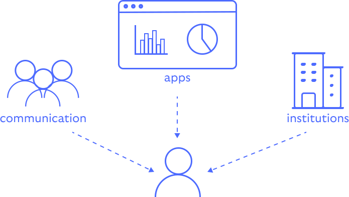

# Decentralized Web Nodes

Decentralized Web Node (DWN) is an emerging standard for data storage and message relay that
supports entities (people, organisations, etc.) in sending and storing both messages and data.

Because a DWN is controlled by its owning entity, a wide variety of decentralised apps and protocols
can be built to be privacy respecting as well as inter-operate across application boundaries.

    

## Features

Notable features of DWNs:

- *Universally addressable* — each DWN is linked to its owning entity using the entity's DID. The 
corresponding DID document is used to expose the location of the DWN as a service endpoint.

- *Replicated* — a DWN may be replicated using masterless eventually consistent replication devices
such as IPFS or similar.

- *Secure* — access is controlled using DID-based authentication and authorization. That is, incoming
messages are signed using a key related to the sender's DID. In addition, data may be secured using
a public key derived from one of the owning entity's public keys.

- *Semantic discovery* — Discover any form of published data simply by knowing its semantic type.

- *Asynchronous message threads* — messages are sent and received over a DID-encrypted universal 
network

- *Any identity type* — DWNs can be owned by any type of entity, including people, organisations,
machines, etc.