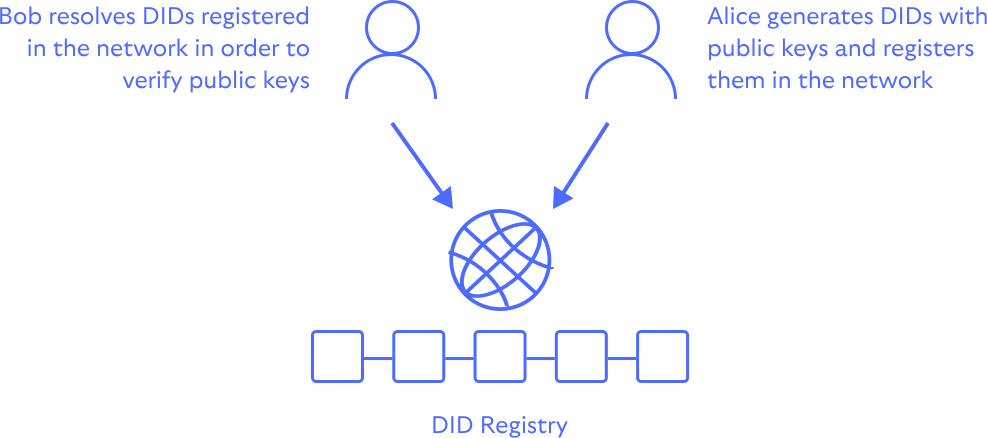

# Decentralized Identifiers

Decentralized Identifiers (DIDs) are self-generated and self-owned identifiers used to uniquely 
identify entities without recourse to a central authority. DIDs are universally discoverable —
they are URIs that resolve to a DID Document containing information such as public key material
and service endpoints for the owning entity.

    

In the context of DWAs, Decentralized Identifiers (DIDs) are used to authenticate individuals
(or organisations) as well as provide and endpoints for messaging and data storage (DWN).
