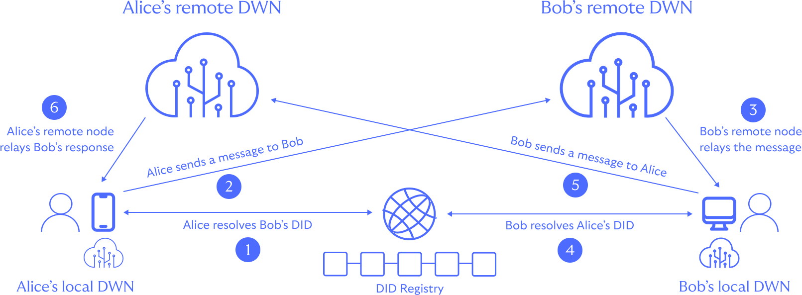

# Decentralized Web Apps

Most digital activities between people, organizations, devices, and other entities require the
exchange of messages and data. Decentralized web apps (DWAs) put users at the centre of these
interactions by adopting a model that lets them store and manage access to their own data and
messages.

Conceptually, users bring their data storage and messaging services (in the form of a DWN) to the
application rather than them being provisioned on their behalf.

## Anatomy of a DWA

Simply, DWAs are apps that store data and messages with their users rather than in a central
location using app infrastructure. In order to do this effectively DWAs use standardised storage
in the form of Decentralised Web Nodes (DWNs) and standardised authentication in the form of
Decentralised Identifiers (DIDs).

    

Given a user's DID, apps can access data, relay messages between users, and generally transact
with others without reliance on location or provider-specific infrastructure, interfaces, or 
routing. Additionally, when well-known protocols are employed, apps can be built to interoperate
with other apps, allowing users to share data and messages between apps.

## Example App

Suspending disbelief for a moment, consider a world where DWN adoption is near ubiquiitous. Alice
is planning a trip and wants to use a DWA to manage her travel plans. She downloads a DWA-aware
travel app and logs in using her DID. The app then asks for permission to access her DWN to store
her travel preferences and reservations.

As Alice uses the app to book flights, hotels, and activities, the app stores her reservations in
her DWN. When she arrives at the airport, the app uses her DWN to retrieve her ticket and boarding 
pass. When she arrives at the hotel, the app uses her DWN to retrieve her reservation and check-in 
details.

And so on...

    

Normally, Alice’s preferences, tickets, reservations, and other travel data would be strewn across
a range of hotel, airline, and travel apps. Apps built using DIDs + DWNs can unify experiences like
this by selectively sharing Alice’s preferences and storing her reservations with her DWN.