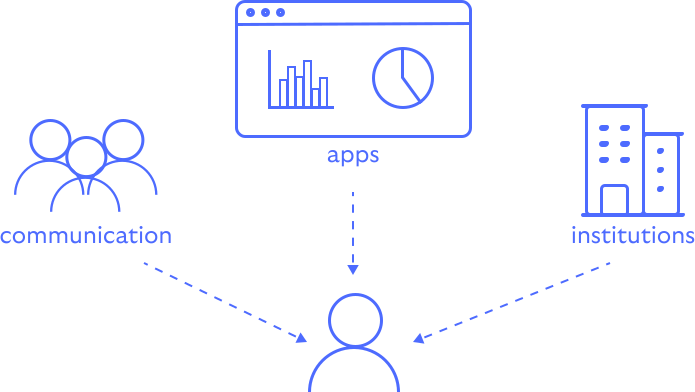
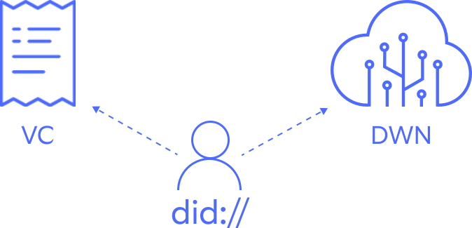
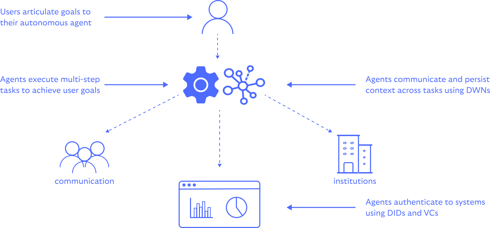

# Decentralized Web Applications

Credibil provides a collection of libraries for building decentralized web applications; a new 
class of applications that puts individuals (and their agents) at the centre.

    

This approach has the potential to revolutionize the way applications are built and used, providing
users with greater privacy and control over their data while reducing the risk of data breaches and
misuse.

## Building Blocks

The building of blocks of decentralized web applications are come from the domain of decentralized
or self-sovereign identity (SSI): Decentralized Identitiers (DIDs), Verifiable Credentials (VCs), and
decentralized web nodes (DWNs).

    

- *Decentralized Identifiers (DIDs)*: tamper-resistant, self-owned identifiers similar to email 
addresses or usernames.

- *Verifiable Credentials (VCs)*: digital credentials that provide cryptographically verifiable 
proof of things like name, age, drivers licence, etc..

- *Decentralized Web Nodes (DWNs)*: replicated data storage and message relay nodes deployed in
a mesh-like construct.

## Architecture

When combined, these building blocks enable the creation of user-centric, portable, and "agentic"
applications. 

### User-centric

In contrast to traditional web applications, where user data is stored in centralized databases, 
DWAs store user data with individual users in a way that is controlled by the user and not a 
central authority.

A shift away from centralized identity and data systems is overdue. Traditional centralized models 
are fragile, creating honeypots for hackers and bad actors. And its not just external threats; 
internal security practices are often disappointingly lax, with administrative teams often having
unfettered access to user data. This centralization of power not only compromises security but also
puts users at the mercy of gatekeepers who can arbitrarily control access to critical services.

### Portable

One side-effect of this approach to applications is the ability to easily move data or reuse data 
across applications. For example, a user could use the same digital identity across multiple 
applications without having to create new accounts or re-enter the same information.

### Agentic

AI agents, acting on our behalf, are set to become increasingly common. These agents will need to
interact with existing systems as well as other agents in a secure and trustworthy manner. The 
building blocks of decentralized web applications provide a foundation for secure and accountable 
interactions.

## AIdentity

AI-based apps are starting to manifest as living agents - autonomous software entities that perceive
their environment, make decisions, and take actions to achieve specific goals. These agents will 
become increasingly prevalent, offering both helpful assistance and, unfortunately, new avenues for
criminal or abusive activities.

    

To navigate this landscape safely, both individuals and service providers can leverage the building
blocks outlined above in conjunction with smart contracts and account abstraction. By using 
**DIDs** and **VCs** to confer trust to AI agents, we create a framework for secure and accountable
AI interactions.

This approach offers several benefits:

1. Verifiable interactions: Each agent's actions can be tied to a specific, trusted identity.
2. Granular permissions: Smart contracts can define precise rules for what an AI agent can and 
   cannot do.
3. Enhanced security: Account abstraction allows for more complex security measures, reducing the
   risk of unauthorized access.
4. Auditability: All interactions can be recorded on a blockchain, providing a tamper-proof record.

### Contextual Awareness

AI agents can also benefit from the decentralized web's ability to store and share data in a
contextual manner. By leveraging **DWNs** to store and retrieve data, agents have the means to
persist information across steps when undertaking complex, multi-step workflows.

Additionally, agents have standards-based access to users' personal information in order to make
informed decisions without compromising privacy.

### Reliable Data

The need for reliable, permissioned AI data sources has been a contentious issue from the outset,
with ongoing debates about data origin, rights, and usage.

The application of DWNs and DIDs at the data source level offers a solution:

1. Provenance: DIDs can prove the origin of data, ensuring its authenticity.
2. Rights management: Smart contracts associated with DIDs can encode usage rights and
   permissions.
3. Verifiable value: The worth and reliability of data can be more accurately assessed when its 
   source is known.
4. Compliance: This approach helps in adhering to data protection regulations by providing clear
   trails of data usage and consent.
5. Incentivization: A DID-based system could allow for fair compensation to data providers, 
   encouraging the creation of high-quality datasets.

By implementing this system, we can create a more transparent, ethical, and efficient ecosystem for
AI data. This not only resolves many of the current data rights issues but also lays the groundwork
for more advanced and trustworthy AI systems in the future.

## Implementation

The libraries are written in Rust and are designed for use in a variety of environments, including
WebAssembly, mobile, and server-side applications.
